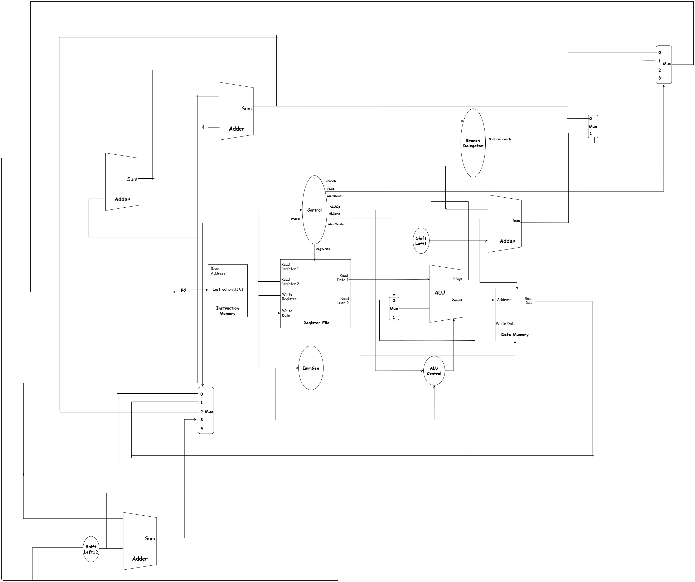

# Pipelined RISC-V Processor

A complete implementation of a RISC-V processor, progressing from a single-cycle architecture to a fully pipelined design.

## Project Overview

This project implements a 32-bit RISC-V processor supporting the RV32I base integer instruction set. The development follows a milestone-based approach, starting with a fundamental single-cycle design and advancing to an optimized pipelined architecture.

## Milestones

### Milestone 1: Single-Cycle Implementation ✅

The single-cycle processor executes one instruction per clock cycle, with all stages completing sequentially within a single clock period.

#### Datapath



#### Architecture Components

**Instruction Fetch & Decode**
- **Program Counter (PC)**: 32-bit register maintaining current instruction address — implemented in the single-cycle top module (`SingleCycle.v`) using the flip-flop primitive (`DFlipFlop.v`).
- **Instruction Memory**: Read-only memory storing program instructions (`InstMem.v`).
- **Immediate Generator**: Extracts and sign-extends immediate values from instructions (`ImmGen.v`).

**Execution**
- **Register File**: 32 general-purpose registers (x0-x31) (`RegisterFile.v`).
- **Register & Register primitives**: Individual register and flip-flop modules (`Register.v`, `DFlipFlop.v`).
- **ALU (Arithmetic Logic Unit)**: Performs arithmetic and logical operations (`ALU.v`).
- **ALU Control Unit**: Generates ALU control signals from instruction funct fields and main control (`ALU_ControlUnit.v`).
- **Shift Units**: Shift-left and generic shifter modules used for shift/branch computations (`Shift_Left.v`, `Shifter.v`, `ShifterTwelve.v`).
- **Multiplexers / Selectors**: Generic mux primitives used across the datapath (`Mux.v`).

**Memory Access**
- **Data Memory**: Read/write memory for load/store operations (`DataMem.v`).
- **Branch Delegator**: Evaluates branch conditions (BEQ, BNE, BLT, BGE, BLTU, BGEU) (`BranchDelegator.v`).

**Write Back / Control**
- **Write Data Selector**: Multiplexes between ALU result, memory data, PC+4, AUIPC result, and LUI data (`WriteData_Selector.v`).
- **Control Unit**: Main control logic producing control signals from opcode/func (`ControlUnit.v`).
- **PC Selector**: Next-PC multiplexer handling branch/jump selection (`PC_Selector.v`).

#### Control Signals

| Signal       | Description                                     |
|--------------|-------------------------------------------------|
| `Branch`     | Enables conditional branching                   |
| `MemRead`    | Enables data memory read                        |
| `MemWrite`   | Enables data memory write                       |
| `ALUSrc`     | Selects between register or immediate for ALU   |
| `RegWrite`   | Enables register file write                     |
| `ALUOp[1:0]` | Determines ALU operation category               |
| `PCsel[1:0]` | Selects next PC value (PC+4, branch, JAL, JALR) |
| `WDsel[2:0]` | Selects write-back data source                  |
| `BreakSel`   | Selects Mux of PC +4 OR PC +0 in case of SYS    |

#### Supported Instructions

**R-Type**: ADD, SUB, AND, OR, XOR, SLL, SRL, SRA, SLT, SLTU  
**I-Type**: ADDI, ANDI, ORI, XORI, SLLI, SRLI, SRAI, SLTI, SLTIU, LW,LHW,LHWU,LB,LBU, JALR  
**S-Type**: SW, SH, SB 
**B-Type**: BEQ, BNE, BLT, BGE, BLTU, BGEU  
**U-Type**: LUI, AUIPC  
**J-Type**: JAL
**SYS-type**: ECALL, EBREAK, PAUSE, FENCE, FENCE.tso

> Note: The supported instruction set is implemented across the control unit, ALU, register file, and memory modules listed above (see `Src/` files).

#### Key Features

- Full RV32I base instruction set support
- Unified ALU with flag generation (Carry, Zero, Overflow, Sign)
- Flexible immediate handling for all instruction formats
- Comprehensive branch condition evaluation
- Multiple write-back data sources

#### Module Hierarchy

```
SingleCycle (Top Module - SingleCycle.v)
├── InstMem.v (Instruction Memory)
├── ControlUnit.v (Main Control Unit)
├── ImmGen.v (Immediate Generator)
├── RegisterFile.v (Register file / 32 registers)
├── Register.v (Register primitive)
├── DFlipFlop.v (Flip-flop primitive)
├── ALU.v (Arithmetic Logic Unit)
├── ALU_ControlUnit.v (ALU Control)
├── Shift_Left.v (Shift-left unit)
├── Shifter.v (Shifter / shift operations)
├── ShifterTwelve.v (Shifter helper / small shifts)
├── Mux.v (Multiplexers)
├── DataMem.v (Data Memory)
├── BranchDelegator.v (Branch Logic)
├── PC_Selector.v (Next PC multiplexer)
└── WriteData_Selector.v (Write-back multiplexer)
```

### Milestone 2: Pipelined Implementation 🚧

*Coming Soon*

The pipelined implementation will introduce five pipeline stages with hazard detection and forwarding mechanisms for improved throughput.

#### Planned Pipeline Stages
1. **IF (Instruction Fetch)**
2. **ID (Instruction Decode)**
3. **EX (Execute)**
4. **MEM (Memory Access)**
5. **WB (Write Back)**

## Project Structure

```
Pipelined-RISC-V-Processor/
├── README.md
├── Assets/
│   └── SingleCycle_Datapath.png
├── Src/
│   ├── ALU.v
│   ├── ALU_ControlUnit.v
│   ├── BranchDelegator.v
│   ├── ControlUnit.v
│   ├── DataMem.v
│   ├── defines.v
│   ├── DFlipFlop.v
│   ├── ImmGen.v
│   ├── InstMem.v
│   ├── Mux.v
│   ├── PC_Selector.v
│   ├── Register.v
│   ├── RegisterFile.v
│   ├── Shifter.v
│   ├── ShifterTwelve.v
│   ├── Shift_Left.v
│   ├── SingleCycle.v
│   └── WriteData_Selector.v
├── TB/
│   └── Program_tb.v
├── RV32I_TestGen/
│   ├── CMakeLists.txt
│   ├── Generator.cpp
│   ├── Generator.h
│   └── main.cpp
│   ├── TestCases/
│   │   ├── TC_R/
│   │   ├── TC_I/
│   │   ├── TC_S/
│   │   ├── TC_U/
│   │   ├── TC_B/
│   │   └── TC_J/
│   └── MemData/
│       ├── Mem_R/
│       ├── Mem_I/
│       ├── Mem_S/
│       ├── Mem_U/
│       ├── Mem_B/
│       └── Mem_J/
└── Assets/
    └── SingleCycle_Datapath.png
```

## Getting Started

### Prerequisites
- Xilinx Vivado (or compatible Verilog simulator)
- Basic understanding of RISC-V ISA
- Familiarity with digital design concepts

### Running the Design

1. Clone the repository
2. Open the project in Vivado
3. Add source files to your project
4. Run behavioral simulation or synthesize for FPGA deployment

## Design Specifications

- **Data Width**: 32 bits
- **Architecture**: RISC-V RV32I
- **Clock**: Single clock domain
- **Reset**: Synchronous active-high reset
- **Memory**: Separate instruction and data memories
- **Addressing**: Word-aligned (addresses divided by 4)

## Testing

The processor has been verified with various test programs including:
- Arithmetic operations
- Logical operations
- Load/Store instructions
- Branch conditions
- Jump instructions (JAL/JALR)
- Upper immediate instructions (LUI/AUIPC)

## Future Enhancements

- [ ] Complete pipelined implementation
- [ ] Hazard detection unit
- [ ] Data forwarding unit
- [ ] Branch prediction
- [ ] Cache implementation
- [ ] Extended instruction set support (M, A, F, D extensions)

## License

This project is developed for educational purposes.

## Contributors

- *Yousef Elmenshawy*
- *Kareem Rashed*

---

**Note**: This is an ongoing educational project. Milestone 2 (pipelined implementation) is under development.
